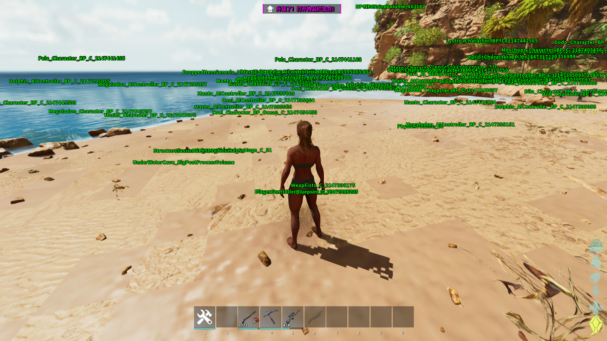

<div align="center">
  
</div>

---

# Unreal Engine Rust SDK (ARK: ASA & Generic)
> A high-performance, macro-driven SDK for Unreal Engine 5+ development in Rust.

---

### Overview
This SDK is a sophisticated Rust implementation for **ARK: Survival Ascended (ASA)** and other Unreal Engine 5 titles. It leverages Rust's powerful metaprogramming to achieve C++-like memory layouts and inheritance patterns.

### Key Technical Features
* **Memory Layout Simulation**: Uses custom `Attribute Macros` to mirror C++ struct alignment and padding precisely.
* **Zero-Cost Inheritance**: Implements the `Deref` trait to simulate C++ class hierarchy, allowing `Actor` to call `Object` methods seamlessly.

### Manual Implementation Required
For security and anti-cheat bypass reasons, the following must be implemented by the user:
1.  **Pattern Scanning**: Locate hardcoded function addresses.
2.  **Stack Spoofing**: Provide a custom `spoofcall` stub to mask return addresses.

### 💻 Tooling Usage
To sync the Rust SDK with the latest Dumper-7 output:
```bash
./offsets_replacer.exe <Dumper7_CppSDK_Path> <Rust_SDK_Src_Path>
```

---

The w! macro is a utility provided by windows-rs to create UTF-16 wide string literals (&'static HSTRING or PCWSTR) at compile-time.